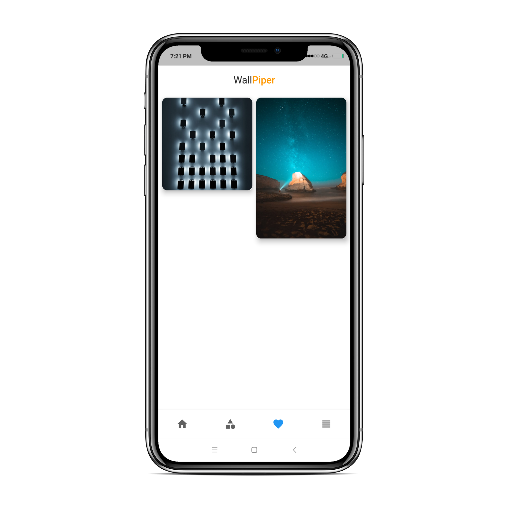
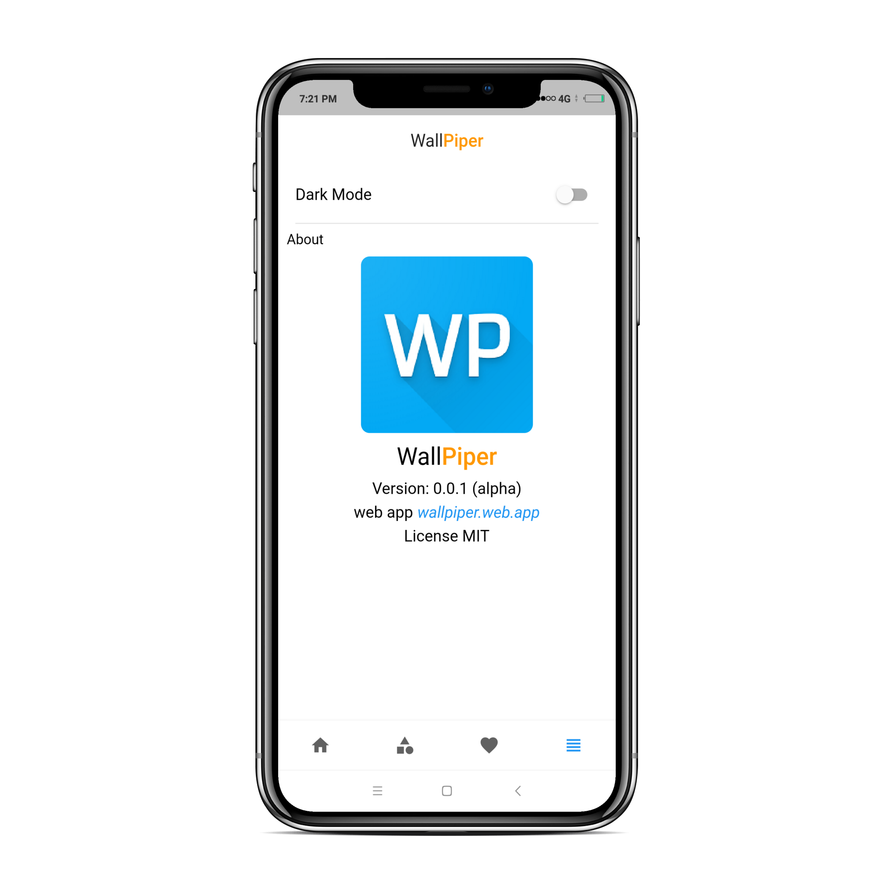

[![Contributors][contributors-shield]][contributors-url]
[![Forks][forks-shield]][forks-url]
[![Stargazers][stars-shield]][stars-url]
[![Issues][issues-shield]][issues-url]
[![MIT License][license-shield]][license-url]
<!-- [![LinkedIn][linkedin-shield]][linkedin-url] -->


<!-- PROJECT LOGO -->
<br />
<p align="center">
  <a href="https://github.com/oGranny/wallpiper">
    
  </a>

  <h3 align="center">Wallpiper</h3>

  <p align="center">
    A wallpaper app to set wallpaper in android and download in web or ios
    <br />
    <a href="https://github.com/oGranny/wallpiper"><strong>Explore the docs »</strong></a>
    <br />
    <br />
    <a href="https://wallpiper.web.app/">View Demo</a>
    ·
    <a href="https://github.com/oGranny/wallpiper/issues">Report Bug</a>
    ·
    <a href="https://wallpiper.web.app/wallpiper.apk">Download app</a>
  </p>
</p>


<!-- TABLE OF CONTENTS -->
## Table of Contents

- [Table of Contents](#table-of-contents)
- [About The Project](#about-the-project)
  - [Built With](#built-with)
- [Getting Started](#getting-started)
  - [Prerequisites](#prerequisites)
  - [Installation](#installation)
- [Usage](#usage)
- [Roadmap](#roadmap)
- [Contributing](#contributing)
- [License](#license)
- [Contact](#contact)


<!-- ABOUT THE PROJECT -->
## About The Project

|  |  |
| ---------------------------------------- | -------------------------------------------- |

|  |  |
| ---------------------------------------------- | ----------------------------------------- |

Wallpiper is a wallpaper app built for android, IOS as well as for web using Google's **Flutter** framework in **Android** one can directly change `lock screen wallpaper` or `home screen wallpaper` using the app where as in IOS and web you have to manually do it.

### Built With
* [Flutter](https://flutter.dev)

<!-- GETTING STARTED -->
## Getting Started

To run this app on your local you need the folowing 

### Prerequisites


* flutter
```sh
git clone https://github.com/flutter/flutter.git -b beta
```

### Installation

1. Get a free API Key at [https://pexels.com/](https://pexels.com/api)
2. Clone the repo
```sh
git clone https://github.com/oGranny/walliper
```
3. Install PUB packages
```sh
flutter pub get
```
4. Enter your pexels API key in `apikey.dart`
```bash
cd wallpiper/lib;
echo "const String APIKEY = $YOUR_API_KEY_THAT_YOU_GENERATED" > apikey.dart

``` 


<!-- USAGE EXAMPLES -->
## Usage

This is a wallpaper app built for android, IOS as well as for web using Google's **Flutter** framework in **Android** one can directly change `lock screen wallpaper` or `home screen wallpaper` using the app where as in IOS and web you have to manually do it.

_For more examples, please refer to the [Documentation](https://wallpiper.web.app)_


<!-- ROADMAP -->
## Roadmap

See the [open issues](https://github.com/oGranny/wallpiper/issues) for a list of proposed features (and known issues).


<!-- CONTRIBUTING -->
## Contributing

Contributions are what make the open source community such an amazing place to be learn, inspire, and create. Any contributions you make are **greatly appreciated**.

1. Fork the Project
2. Create your Feature Branch (`git checkout -b feature/AmazingFeature`)
3. Commit your Changes (`git commit -m 'Add some AmazingFeature'`)
4. Push to the Branch (`git push origin feature/AmazingFeature`)
5. Open a Pull Request


<!-- LICENSE -->
## License

Distributed under the MIT License. See `LICENSE` for more information.


<!-- CONTACT -->
## Contact

Your Name - [@oGranny](https://github.com/oGranny/) - ogranny.github.io@gmail.com

Project Link: [https://github.com/oGranny/wallpiper](https://github.com/oGranny/wallpiper)


<!-- MARKDOWN LINKS & IMAGES -->
<!-- https://www.markdownguide.org/basic-syntax/#reference-style-links -->
[contributors-shield]: https://img.shields.io/github/contributors/oGranny/wallpiper.svg?style=flat-square
[contributors-url]: https://github.com/oGranny/wallpiper/graphs/contributors
[forks-shield]: https://img.shields.io/github/forks/oGranny/wallpiper.svg?style=flat-square
[forks-url]: https://github.com/oGranny/wallpiper/network/members
[stars-shield]: https://img.shields.io/github/stars/oGranny/wallpiper.svg?style=flat-square
[stars-url]: https://github.com/oGranny/wallpiper/stargazers
[issues-shield]: https://img.shields.io/github/issues/oGranny/wallpiper.svg?style=flat-square
[issues-url]: https://github.com/oGranny/wallpiper/issues
[license-shield]: https://img.shields.io/github/license/oGranny/wallpiper.svg?style=flat-square
[license-url]: https://github.com/oGranny/wallpiper/blob/master/LICENSE.txt
<!-- [linkedin-shield]: https://img.shields.io/badge/-LinkedIn-black.svg?style=flat-square&logo=linkedin&colorB=555 -->
<!-- [linkedin-url]: https://linkedin.com/in/othneildrew -->
[product-screenshot]: images/screenshot.png